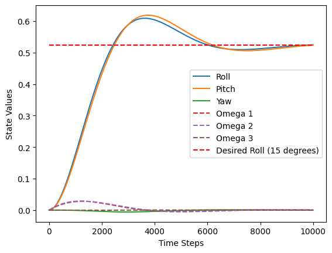

```python
import numpy as np
import matplotlib.pyplot as plt
```


```python
def cntrl(x, x_d):
    assert x.shape == (6, 1)
    assert x_d.shape == (6, 1)

    K_p = 1
    K_d = 10

    e = x - x_d

    # PD <- PID will need to remember error, bigger state
    u_1 = -1 * (K_p * e[0] + K_d * e[3])
    u_2 = -1 * (K_p * e[1] + K_d * e[4])
    u_3 = -1 * (K_p * e[2] + K_d * e[5])
    u = np.array([[u_1], [u_2], [u_3]])  # control input
    u.resize((3, 1))  # ensure shape is (3, 1)
    assert u.shape == (3, 1)

    return u

    
def dyn(x, I, u):
    assert x.shape == (6, 1)

    I_1, I_2, I_3 = I
    M_1, M_2, M_3 = u

    x_dot = np.zeros((6, 1))  # Initialize the state derivative

    x_dot[0] = x[3]
    x_dot[1] = x[4]
    x_dot[2] = x[5]
    
    x_dot[3] = 1/I_1 * (M_1 - (I_3 - I_2) * x[4] * x[5])
    x_dot[4] = 1/I_2 * (M_2 - (I_1 - I_3) * x[5] * x[3])
    x_dot[5] = 1/I_3 * (M_3 - (I_2 - I_1) * x[3] * x[4])

    return x_dot
```


```python
delta_t = 0.01  # time step
#       0      1     2    3       4      5
# x = [roll, pitch, yaw, omg_1, omg_2, omg_3]

I = np.array([100, 110, 120])  # Inertia matrix
x = np.zeros((6, 1))  # initial conditions for the state vector

t = 0  # initial time
```


```python
while( t < 100):

    curr_x = x[:, -1].reshape(-1, 1)  # last column of x
    x_desired = np.array([[np.pi/6], [np.pi/6], [0], [0], [0], [0]])  # target roll, pitch, yaw, omg_1, omg_2, omg_3

    # Compute Control Input
    u = cntrl(curr_x, x_desired)

    # Compute the state derivative
    x_dot = dyn(curr_x, I, u)
    assert x_dot.shape == (6, 1)

    # Simulate the system using Euler Integration
    next_x = curr_x + x_dot * delta_t

    x = np.hstack((x, next_x))  # append the new state to x

    t += delta_t
```


```python
plt.plot(x[0, :], label='Roll')
plt.plot(x[1, :], label='Pitch')
plt.plot(x[2, :], label='Yaw')
plt.plot(x[3, :], label='Omega 1', linestyle='--')
plt.plot(x[4, :], label='Omega 2', linestyle='--')
plt.plot(x[5, :], label='Omega 3', linestyle='--')
plt.hlines(y=np.pi/6, xmin=0, xmax=x.shape[1]-1, colors='r', linestyles='dashed', label='Desired Roll (15 degrees)')
plt.xlabel('Time Steps')
plt.ylabel('State Values')
plt.legend()
plt.show()
```


    

    

